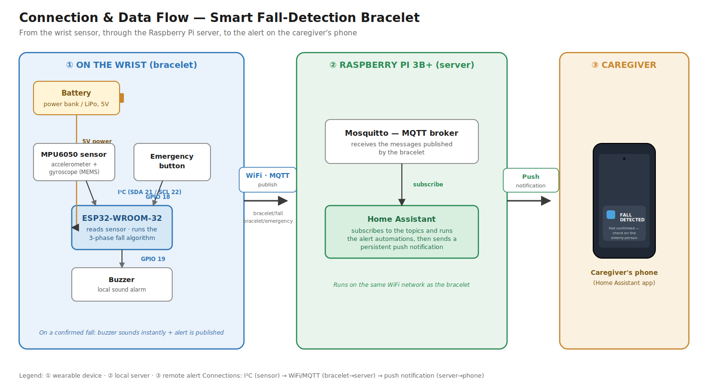
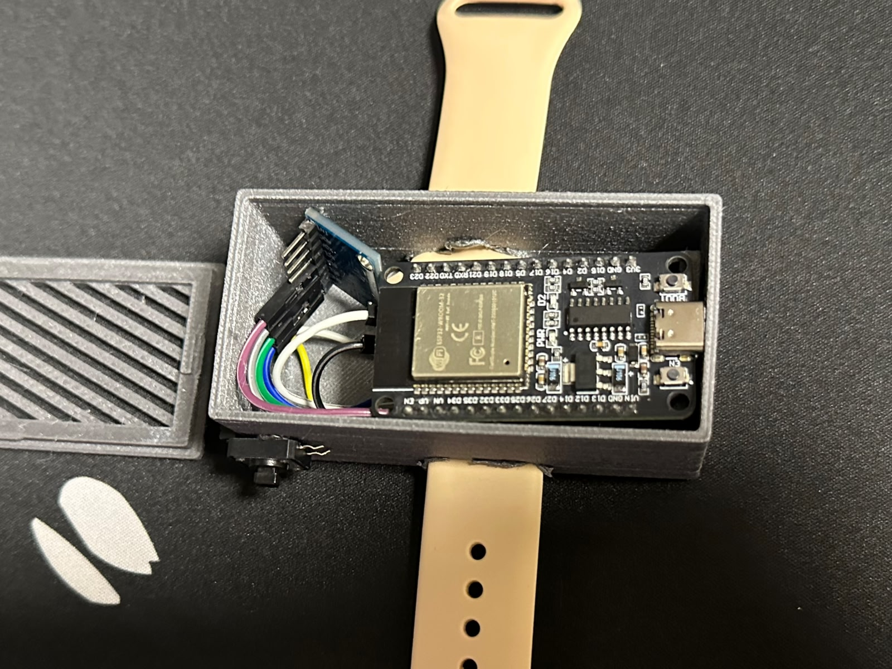
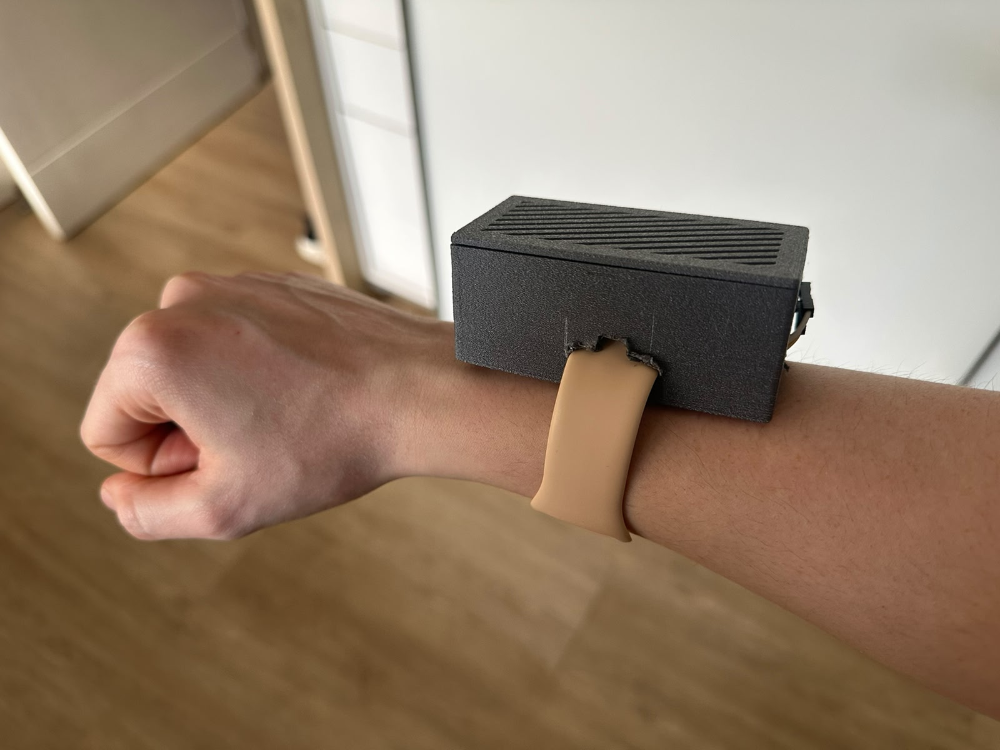
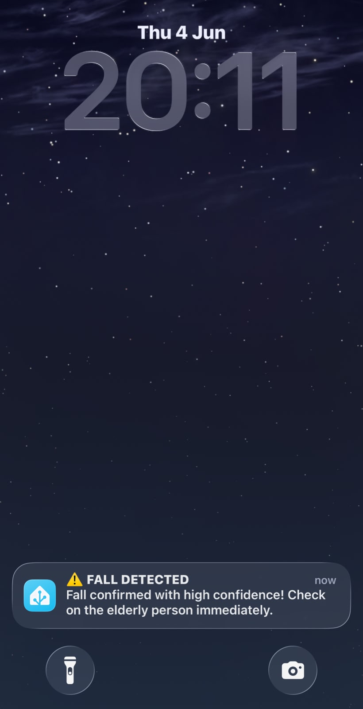
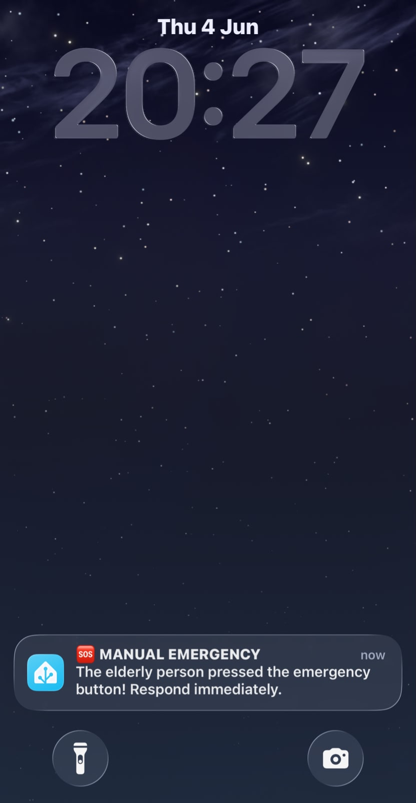

# 🩺 Smart Bracelet for Elderly Monitoring and Safety

> Automatic fall detection with ESP32 + MPU6050, MQTT alerts, and a persistent
> phone notification through Home Assistant.


📄 Full documentation: [English](documentation/technical-document/Technical_Document_EN.docx) · [Português](documentation/technical-document/Documentacao_Tecnica_PT.docx)

---

## 📌 Introduction

Falls are a leading cause of serious injury and death among the elderly, and the
time spent on the floor without help makes the outcome much worse. This project
develops a low-cost wearable bracelet that detects falls automatically and calls
for help, attacking exactly that delay.

Developed for the course **Integrative Project I — 2026.1**, Computer
Engineering, Federal University of Santa Catarina (UFSC) — Araranguá Campus.

## 📝 Description

The bracelet, built around an **ESP32**, reads an **MPU6050** inertial sensor on
the wrist and runs a 3-phase algorithm to detect falls. When a fall is confirmed,
a local **buzzer** sounds immediately and an alert is published over **WiFi/MQTT**
to a **Home Assistant** server on a **Raspberry Pi**, which sends a persistent
notification to the caregiver's phone. The wearer can also trigger a manual
**emergency button**.

## 🎯 Objectives

**General:** develop an ESP32-based smart bracelet for monitoring the elderly,
with fall detection and remote alerts via Home Assistant.

**Specific:**
- Detect falls automatically with an accelerometer/gyroscope.
- Provide a manual emergency button.
- Send alerts via MQTT to Home Assistant.
- Trigger an immediate local sound alarm.
- Deliver real-time notifications to the caregiver.

---

## 🔌 Connection & data flow



> Full-resolution diagram: [`design/diagrams/connection_flow.svg`](design/diagrams/connection_flow.svg)

---

## ✅ Implemented features

- **Automatic fall detection** — 3-phase algorithm: free fall → impact → rest
- **Local sound alarm** — buzzer with distinct patterns: 3 beeps (medium confidence), 5 beeps (high confidence), 10 beeps (emergency)
- **Manual emergency button** — the wearer can trigger it directly
- **Persistent phone notification** — via the Home Assistant app; stays until acknowledged
- **Sensor auto-recovery** — automatic re-initialization if the MPU6050 enters sleep mode
- **Two confidence levels** — `high_confidence` (free fall + impact + rest + rotation) and `medium_confidence` (free fall + impact + rest)

---

## 📁 Repository structure

```
smart-fall-detection-bracelet/
├── components/          # 📦 Bill of materials + component datasheets (PDF)
├── design/              # 🎨 Wiring schematic, connection tables
│   └── diagrams/        #    ← connection & data-flow diagram
├── documentation/       # 📚 Requirements, theory, user manual, technical docs (EN + PT)
│   └── literature/      #    ← theoretical background + the source papers
├── firmware/            # 💾 ESP32 sketch (firmware/main/) + per-sensor docs + libraries
│   └── sensors/         #    ← MPU6050 characteristics, pinout, code, serial output
├── home_assistant/      # 🖧 Server-side automations and setup guide
└── photos/              # 📸 Photos of the prototype + the alert screens
```

> Quick links: [Firmware](firmware/) · [MPU6050 sensor doc](firmware/sensors/MPU6050/MPU6050.md) · [Theoretical background](documentation/literature/theoretical-background.md) · [Home Assistant setup](home_assistant/README.md) · [Bill of Materials](components/README.md) · [Wiring](design/README.md) · [Photos](photos/README.md)

---

## 🧰 Hardware — bill of materials

| Component | Quantity | Specification / Note |
|---|---|---|
| ESP32-WROOM-32 | 1 | Any ESP32 DevKit |
| MPU6050 sensor (GY-521 module) | 1 | Accelerometer + gyroscope, I²C |
| Active 5V buzzer | 1 | Sounds when powered (no PWM needed) |
| Push button | 1 | 4-pin button, only 2 pins used |
| Raspberry Pi 3B+ | 1 | Home Assistant server |
| 32GB SD card | 1 | For Home Assistant OS |
| Female-female jumpers | ~8 | For solderless connection |
| Power bank or LiPo battery | 1 | Portable power |

## 📍 Pinout (microcontroller → component)

| ESP32 pin | Component | Signal |
|---|---|---|
| 3.3V | MPU6050 VCC | Power |
| GND | MPU6050 GND, buzzer −, button | Ground |
| GPIO 21 | MPU6050 SDA | I²C data |
| GPIO 22 | MPU6050 SCL | I²C clock |
| GPIO 19 | Buzzer | Sound alarm (inverted logic: LOW = on) |
| GPIO 18 | Push button | Emergency input (INPUT_PULLUP) |
| VIN (5V) | Buzzer + | Power |

Full wiring: [`design/README.md`](design/README.md) · Sensor details: [`firmware/sensors/MPU6050/MPU6050.md`](firmware/sensors/MPU6050/MPU6050.md)

---

## 💻 Software & versions

| Software / library | Version | Role |
|---|---|---|
| Arduino IDE | 2.x | Firmware development and flashing |
| ESP32 board package (Espressif) | 2.x | ESP32 core for Arduino |
| PubSubClient | 2.8+ | MQTT client (firmware) |
| Wire / WiFi | bundled with ESP32 core | I²C and WiFi |
| Home Assistant OS | current | Server platform (Raspberry Pi) |
| Mosquitto broker (HA add-on) | current | MQTT broker |

Library list: [`firmware/libraries.txt`](firmware/libraries.txt)

---

## ⚙️ Quick start

### 1. Prepare the Arduino IDE
1. Install [Arduino IDE 2](https://arduino.cc/en/software)
2. In **Preferences**, add the ESP32 board URL:
   ```
   https://raw.githubusercontent.com/espressif/arduino-esp32/gh-pages/package_esp32_index.json
   ```
3. Install the **esp32** package via the Boards Manager
4. Install the **PubSubClient** library via the Library Manager
5. Select the board: **ESP32 Dev Module**

### 2. Configure credentials
```bash
cp firmware/main/config.h.example firmware/main/config.h
```
Edit `config.h` with your WiFi and MQTT credentials. This file is in
`.gitignore`, so your credentials never reach GitHub.

### 3. Flash the firmware
Open `firmware/main/main.ino` in the Arduino IDE, select the correct COM
port, and click **Upload**. On power-up you should hear one short beep.

### 4. Set up Home Assistant
Follow the full guide in [`home_assistant/README.md`](home_assistant/README.md).

---

## 📡 MQTT topics

| Topic | Payload | When |
|---|---|---|
| `bracelet/fall` | `high_confidence` | Fall with detected rotation |
| `bracelet/fall` | `medium_confidence` | Fall without detected rotation |
| `bracelet/emergency` | `manual_button` | Emergency button pressed |
| `bracelet/status` | `online` | ESP32 connected to the broker |

---

## 🧠 The detection algorithm in brief

A real fall is a *sequence* of three phases, not a single threshold crossing:

```
PHASE 1 — Free fall   : magnitude < ~0.30g + high jerk
        ↓ (within 1 second)
PHASE 2 — Impact      : magnitude > ~1.16g
        ↓ (wait 3 seconds)
PHASE 3 — Rest        : magnitude back near 1g (body still)
        ↓
FALL CONFIRMED → buzzer + MQTT
```

Everyday gestures do **not** include a free-fall phase, so they never pass
Phase 1. The full reasoning, parameter calibration, and references are in
[`documentation/literature/theoretical-background.md`](documentation/literature/theoretical-background.md).

---

## 📸 The prototype

| | |
|---|---|
|  |  |
|  |  |

More photos in [`photos/`](photos/README.md). The enclosure is a deliberately
simple 3D-printed prototype case and came out bulky; a smaller case is future
work, and no STL is published since it was only a quick prototype.

---

## 👥 Team

| Team |
|---|
| Leticia Damasio Veran |
| Valentina Ragnini Scherer Col Debella Leiria |

**Institution:** UFSC — Araranguá Campus

---

## 📄 License

MIT License — see the [LICENSE](LICENSE) file for details.
