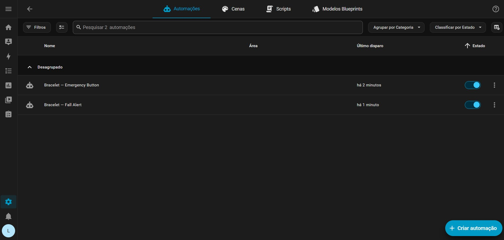
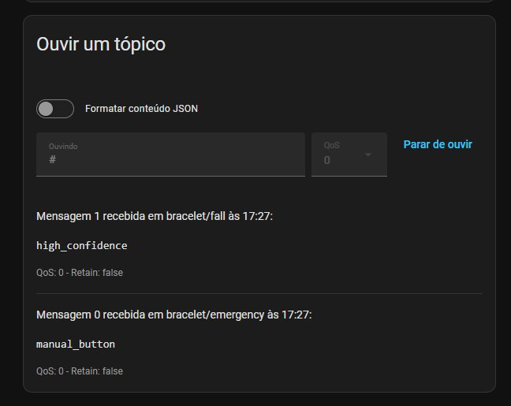

# Home Assistant Setup

Step-by-step guide to set up the Home Assistant server on the Raspberry Pi 3B+.

---

## 1. Install Home Assistant OS on the Raspberry Pi

### What you need
- Raspberry Pi 3B+
- 32GB SD card
- Network cable (RJ45)
- Micro USB power supply

### Steps

1. Download the **Raspberry Pi Imager** from [raspberrypi.com/software](https://raspberrypi.com/software)
2. Open the Imager and select:
   - **Device:** Raspberry Pi 3
   - **OS:** Other specific purpose OS → Home assistants and home automation → **Home Assistant OS (RPI 3)**
   - **Storage:** your SD card
3. Click **Next → Write** and wait (~15 minutes)
4. Insert the SD card into the Raspberry Pi, connect the network cable, and power it on
5. Wait **10 minutes** for the first boot

### Accessing it for the first time

In the PC browser (same network):
```
http://homeassistant.local:8123
```

If that does not work, find the IP with:
```bash
# In the Windows Command Prompt
arp -a
# Look for the MAC address B8:27:EB:XX:XX:XX (Raspberry Pi prefix)
```

---

## 2. Configure the network via the SD card (if needed)

If the Raspberry Pi does not connect automatically, create the network files on the SD card:

**Folder:** `hassos-boot/CONFIG/network/`

**File `my-network` (WiFi):**
```ini
[connection]
id=my-network
type=802-11-wireless

[802-11-wireless]
ssid=YourNetworkName
mode=infrastructure

[802-11-wireless-security]
auth-alg=open
key-mgmt=wpa-psk
psk=YourNetworkPassword

[ipv4]
method=auto

[ipv6]
addr-gen-mode=stable-privacy
method=auto
```

**File `my-ethernet` (network cable):**
```ini
[connection]
id=my-ethernet
type=ethernet

[ethernet]
mac-address=B8:27:EB:XX:XX:XX

[ipv4]
method=auto

[ipv6]
addr-gen-mode=stable-privacy
method=auto
```

---

## 3. Install the MQTT broker (Mosquitto)

1. In Home Assistant, go to: **Settings → Add-ons**
2. Click **Add-on Store** (bottom right)
3. Search for **Mosquitto broker** and install it
4. Enable the options:
   - ✅ Start on boot
   - ✅ Watchdog
5. Click **Start**

---

## 4. Create an MQTT user

1. Go to: **Settings → People → Add person**
2. Create a user (e.g. `mqtt_user`) with a password
3. Write down the credentials — they will be used in the ESP32 `config.h`

---

## 5. Integrate MQTT into Home Assistant

1. Go to: **Settings → Devices & services**
2. Click **Add integration**
3. Search for **MQTT**
4. Fill in:
   - Broker: `core-mosquitto`
   - Port: `1883`
   - User and password created in the previous step
5. Click **Submit**

---

## 6. Create the alert automations

### Option A — Via the interface (recommended)
1. Go to: **Settings → Automations → Create automation → Start with an empty automation**
2. Configure them following the `automation_fall.yaml` and `automation_emergency.yaml` files

### Option B — Import the YAML
Paste the contents of the YAML files directly into the automation's YAML editor.

> ⚠️ Replace `mobile_app_YOUR_PHONE` with your device's ID. The ID appears in: **Settings → Companion App**

---

## 7. Install the Home Assistant app on the phone

- **Android:** [Play Store — Home Assistant](https://play.google.com/store/apps/details?id=io.homeassistant.companion.android)
- **iOS:** [App Store — Home Assistant](https://apps.apple.com/app/home-assistant/id1099568401)

After installing:
1. Open the app and connect to your server: `http://RASPBERRY_IP:8123`
2. Allow notifications
3. The device will appear in: **Settings → Companion App**

---

## 8. Test the communication

In Home Assistant, go to: **Settings → Devices & services → MQTT → Configure → Listen to a topic**

Type `bracelet/fall` and click **Start listening**.

Simulate a fall with the sensor — you should see `high_confidence` or `medium_confidence`.

---

## 9. Configure for a presentation (hotspot)

To use it on networks that isolate devices (such as a campus network):

1. Enable the hotspot on your phone
2. Connect the Raspberry Pi to the hotspot:
   ```
   # In the HA terminal (via HDMI or SSH)
   network update wlan0 --ipv4-method auto --wifi-ssid "HotspotName" --wifi-psk "HotspotPassword"
   ```
3. Update `MQTT_SERVER` in the ESP32 `config.h` with the Raspberry Pi's new IP
4. Recompile and flash the firmware

---

## Troubleshooting

| Problem | Solution |
|---|---|
| `homeassistant.local` does not open | Use the direct IP: check it with `arp -a` on the PC |
| MQTT does not connect (rc=-2) | Check the Raspberry Pi IP and that Mosquitto is running |
| Sensor returns to zero | Auto-reinitialization after 5 failures — normal if a cable is loose |
| Notification does not arrive | Check that the app has notification permission on the phone |

---

## MQTT topics reference

| Topic | Payload | When |
|---|---|---|
| `bracelet/fall` | `high_confidence` | Fall with detected rotation |
| `bracelet/fall` | `medium_confidence` | Fall without detected rotation |
| `bracelet/emergency` | `manual_button` | Emergency button pressed |
| `bracelet/status` | `online` | ESP32 connected to the broker |

---

## Services running (screenshots)

Evidence of the server-side services working end to end:

**Automations** — both automations active in Home Assistant, with their last
trigger times:



**MQTT broker** — messages arriving from the bracelet on the
`bracelet/fall` and `bracelet/emergency` topics (listened to via the MQTT
integration's *Listen to a topic* tool):


