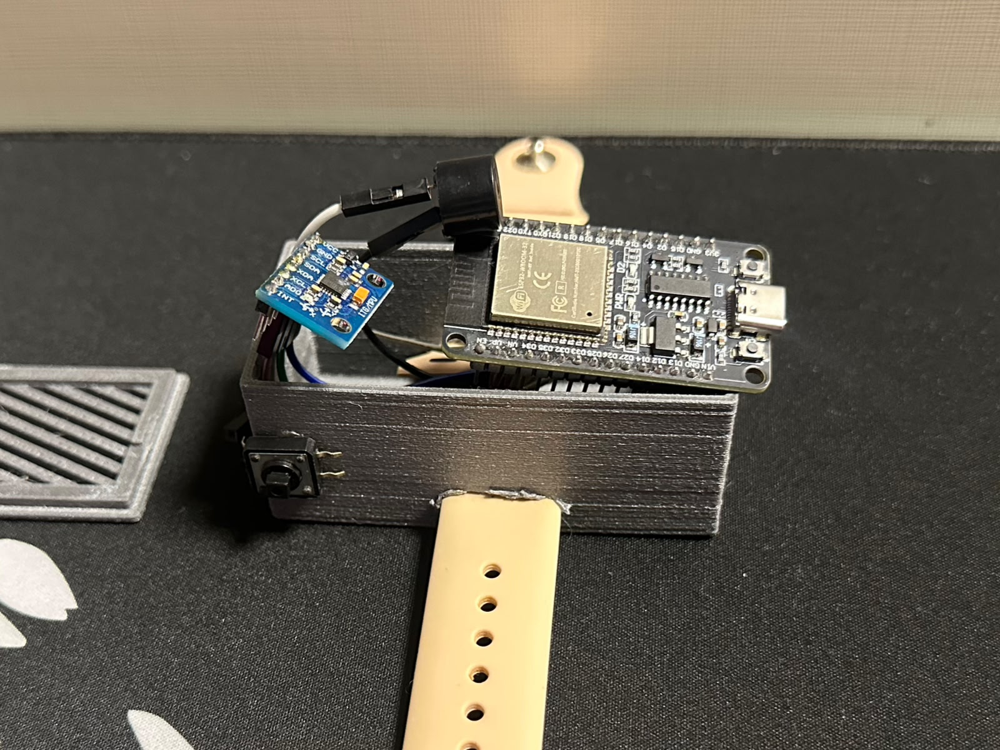
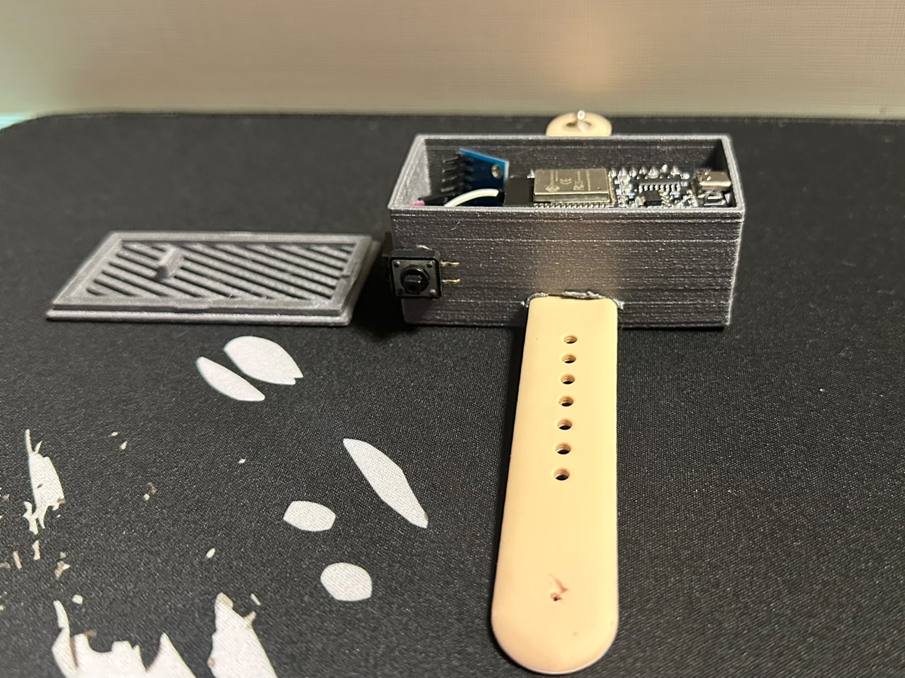
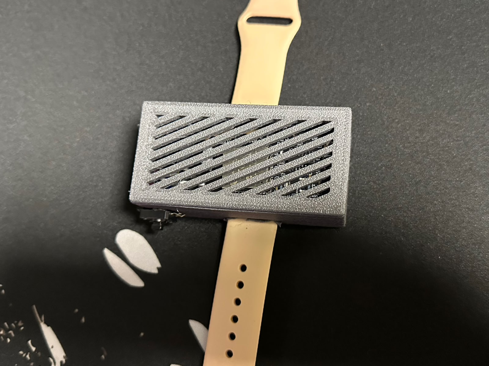
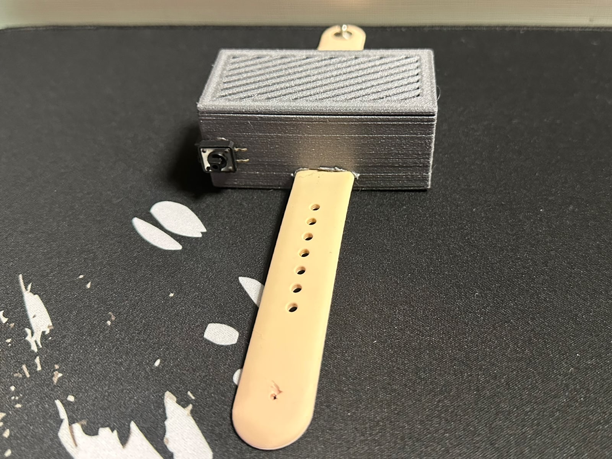
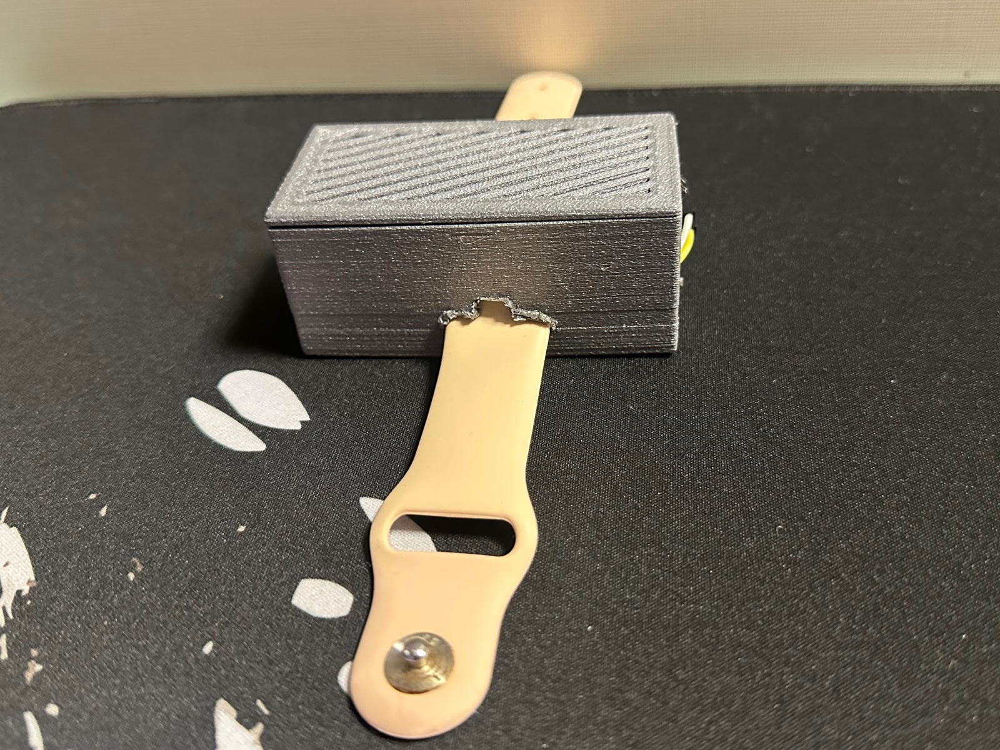
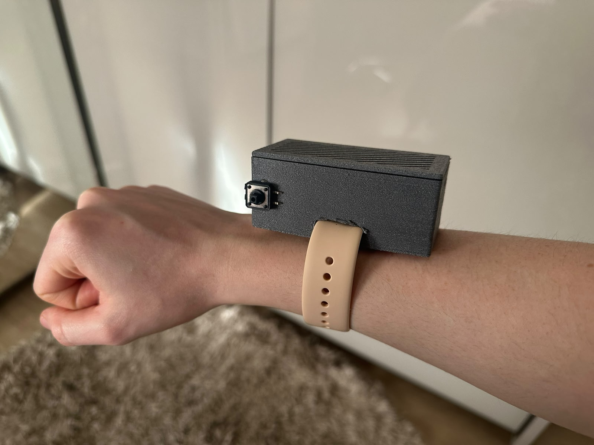

# 📸 Photos

Photos of the physical prototype and the alert screens.

## Final assembly (montagem final)

| Photo | What it shows |
|---|---|
|  | Top-down view inside the case: ESP32, MPU6050 and jumpers |
|  | Close-up of the MPU6050 (GY-521), the buzzer and the ESP32 |
|  | Open case next to its 3D-printed lid, with the emergency button on the side |
|  | Closed case (vented lid) |
|  | Closed case with the wrist strap |
|  | Side view of the closed case |
|  | Bracelet worn on the wrist |
|  | Worn on the wrist — the emergency button is reachable on the side |

> The enclosure is a deliberately simple 3D-printed prototype case. It came out
> bulky (it houses a full ESP32 DevKit on a breadboard-style wiring); a smaller
> case is listed as future work. Because it was only a quick prototype, no 3D
> model file (STL) is published.

## App screens (telas do sistema)

### Phone notifications

| Screen | What it shows |
|---|---|
|  | Persistent push notification on a fall (high confidence) |
|  | Persistent push notification when the emergency button is pressed |

### Home Assistant (server side)

| Screen | What it shows |
|---|---|
|  | The two active automations — `Bracelet — Fall Alert` and `Bracelet — Emergency Button` — with their last-triggered times |
|  | The MQTT broker receiving live messages: `high_confidence` on `bracelet/fall` and `manual_button` on `bracelet/emergency` |
